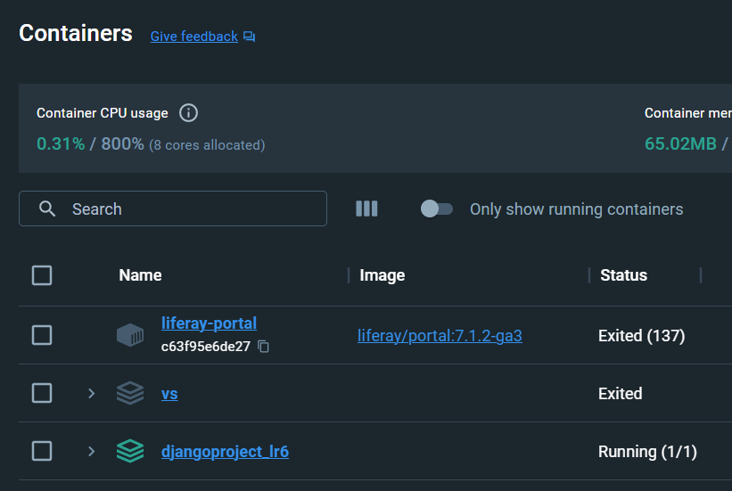

# Отчет по ЛР 8
1. "Упакованное" приложение лежит в django-polls.
Создание "упаковки":
```
python setup.py sdist
```
Сделано по [туториалу](https://docs.djangoproject.com/en/3.2/intro/reusable-apps/).

3. Контейнеризованный вариант написанного приложения лежит в djangoProject_lr6
Сборка контейнера:
```
docker-compose up -d
```
Сделано по [туториалу](https://pythonru.com/uroki/docker-django).

